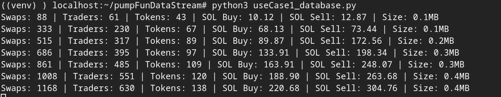
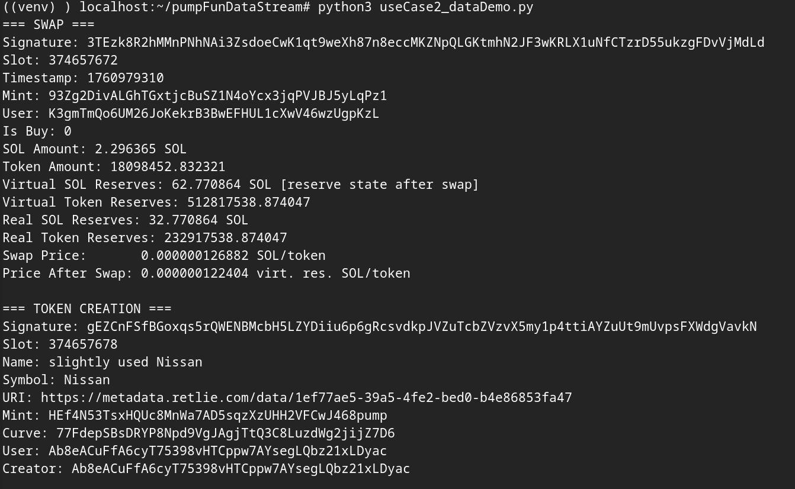

# PumpFun-Data-Stream
A very lightweight library that registers Pump.fun token creation and swap events live as they occur on chain. Easily extensible.


### Use Case 1: Database Storage


Continuously captures all swaps to SQLite with periodic statistics on volume, traders, and tokens.

### Use Case 2: Event Inspection


Outputs complete swap and token creation event data for analysis and debugging.

## Installation
```bash
pip install websockets base58
```
